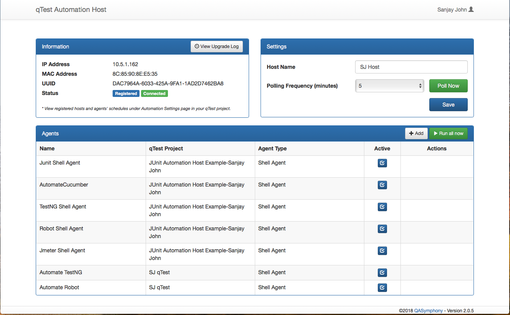
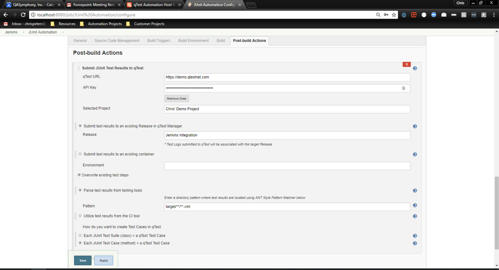

# Trigger Jenkins Job – A Python Script for the Automation Host

## Overview:

This example illustrates how to write a script that will trigger a Jenkins Job from the Automation Host

## Set up Computer:

1) Install Python 3.6 from [https://www.python.org/downloads/](https://www.python.org/downloads/)

**From Terminal (Mac) or Command Prompt (Windows):**

1. Make sure pip was installed correctly with python on your machine by running the following command. It should output the pip version:

 `pip --version`

 Note: pip3 will work as well. Try `pip3 --version`

2. If pip is not installed, run the following command to install pip:

 `python -m -ensurepip --default-pip`

More information about downloading pip can be found at [https://packaging.python.org/tutorials/installing-packages/](https://packaging.python.org/tutorials/installing-packages/)

3. After you have ensured pip is installed, run the following commands individually:

`pip install requests`

Note: If using pip3 run commands with pip3 instead e.g. `pip3 install requests`

This command will install the necessary modules required to run the python script. The module will send a request to the Jenkins API

## Update Configuration File:

Open config.json and enter the values from your Jenkins instance.

**JOBNAME:** Name of the specific jenkins job that you want to run from the configuration file

**JenkinsAPIToken:** Your Jenkins API token, found under the administration of your user in Jenkins.

**JenkinsJobName:** The name of the Jenkins Job you want to trigger.

**JenkinsJobToken:** The Authentication Token you define for your job under Build Triggers.

**JenkinsURL:** The base URL of your Jenkins instance.

**JenkinsUserName:** The username with which you administer your Jenkins instance.

An example configuration file is shown below. In this example there are two job instances that could be called by the script

## Set Up Automation:

1. Navigate to your Automation Host

 

2.    Add a new agent and fill out the path directory and enter the script into the kick off script field

 
**Agent Name:** Name

**qTest Manager Project:** Choose your project

**Agent Type:** Choose Shell Agent

**Directory:** The directory containing your scripts and shell agent (Directory where the scripts were cloned)

**Set Allocated Execution Time:** Amount of time you expect the script to take to execute in minutes

**Kick-off scripts:** The file path to your shell script. This shell scripts takes in two inputs, one for using git and the second for updating your current test cycle.

### Python Script Input:

The script takes in one arugment, which correlates to the name of the job configuration in the config.json file. In this example file shown above, the inputs could be either ROBOT or JUNIT. In this example we are using JUNIT.

## For Mac Users (Use python3):

## For Windows Users (Use python):

## qTest Plugin:

Make sure that the qTest plugin in configured correctly in Jenkins as shown below:

## Running Shell Script:

Start the shell script by pressing yellow button under the action text field, which will upload all of the tests cases to qTest. You can schedule remaining runs from qTest Manager.

 

