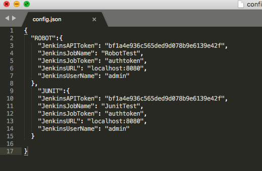
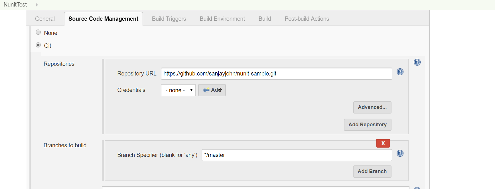
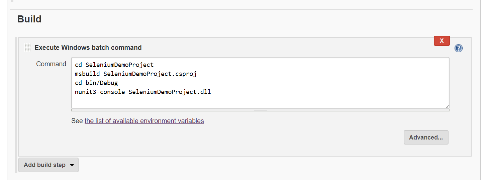
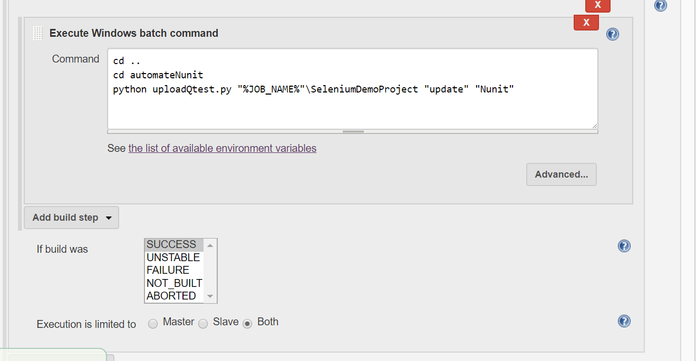

# Automate Nunit + Selenium with MSBuild and Nunit Console Runner through Jenkins

## Overview:

This guide illustrates how to upload results to qTest using Python Scripts. This will allow for more user customization than provided in the qTest plugin. The testcases will be built automatically into the project with this API call even if they are not already created, and the test runs will appear under the Test Execution Tab under the "Selenium Automated Tests" test-cycle. Also, the console output will be appended to your test runs in the attachment section. Place this folder on your Jenkins workspace directory as shown below:

## Set up Machine running Jenkins:

1) Install Python 3.6 from [https://www.python.org/downloads/](https://www.python.org/downloads/)

2) Install Build Tools for Visual Studio from [https://www.visualstudio.com/downloads/](https://www.visualstudio.com/downloads/)

3) Install Nunit Console from [https://github.com/nunit/nunit-console/releases/](https://github.com/nunit/nunit-console/releases/)

4) Install Firefox from [https://www.mozilla.org/en-US/firefox/new/](https://www.mozilla.org/en-US/firefox/new/)

### From Command Prompt:

1. Make sure pip was installed correctly with python on your machine by running the following command. It should output the pip version:

 `pip --version`

 Note: pip3 will work as well. Try `pip3 --version`

2. If pip is not installed, run the following command to install pip:

 `python -m -ensurepip --default-pip`

More information about downloading pip can be found at [https://packaging.python.org/tutorials/installing-packages/](https://packaging.python.org/tutorials/installing-packages/)

3. After you have ensured pip is installed, run the following commands individually :

`pip install requests`

`pip install beautifulsoup4`

`pip install lxml`

`pip install pybase64`

Note: If using pip3 run commands with pip3 instead e.g. `pip3 install requests`

These commands will install the necessary modules required to run the python scripts. The modules are used to send requests to the API, read json configuration files, parse xml documents, and upload files to qTest.

## Update Configuration File:

### qTest Manager Configuration file (conf.json)

**qtest\_api\_token:** The token used to authorize the connection to qTest Manager

**qtest\_url:** The personal url that is used to access QASymphony API

**project\_id:** The ID of the Project that the script will upload results to on qTest Manager

Open the conf.json file and update with your personal information. Enter your own qTest URL, API Token, and Project ID found in the qTest Manager Environment.

### Jenkins Configuration file (jenkinsconfig.json)

**JOBNAME:** Name of the specific jenkins job that you want to run from the configuration file

**JenkinsAPIToken:** Your Jenkins API token, found under the administration of your user in Jenkins.

**JenkinsJobName:** The name of the Jenkins Job you want to trigger.

**JenkinsJobToken:** The Authentication Token you define for your job under Build Triggers.

**JenkinsURL:** The base URL of your Jenkins instance.

**JenkinsUserName:** The username with which you administer your Jenkins instance.

An example configuration file is shown below. In this example there are two job instances that could be called by the script

## Set Up Jenkins General Configuration:

For this example we will be pulling a NUnit Sample Test from GitHub&#39;s nunit-sample [https://github.com/sanjayjohn/nunit-sample.git](https://github.com/sanjayjohn/nunit-sample.git). Place the url in in the Jenkins Project configuration as shown below.

## Set up Jenkins Build Configuration:

### For Mac Users (Use Execute shell):

 

### For Windows Users (Use Execute Windows batch command):

## Set Up Jenkins Post Build Configuration:

1. Choose Execute Scripts and add a post build step

2. Keep the default values for "If build was" and "Execution is limited to" and click "Add build step"

### For Mac Users (Use Execute shell):

 

### For Windows Users (Use Execute Windows batch command):

### uploadQtest.py inputs

The inputs for the python scripts are:
1. Repository where test results are located
2. "update" or "false" denoting whether an existing test-cycle will be updated
3. Name of Job in jenkinsconfig.json file so that credentials can be acquired for accessing Console Output.
 
## Running Automation:

This job can be run from Jenkins, but to trigger this Jenkins job from the Automation Host follow the guide in the triggerJenkins directory

 
