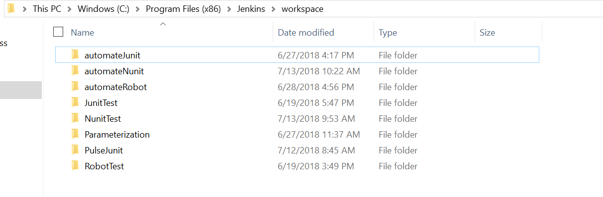
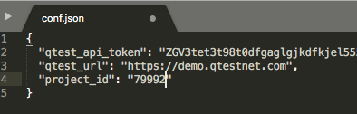
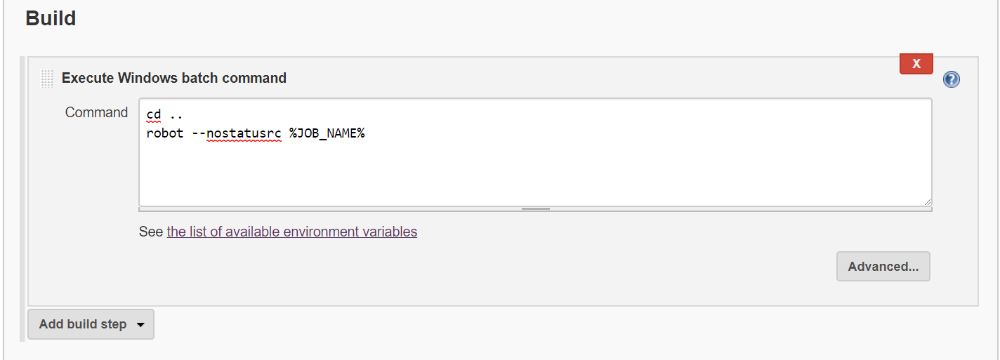

# Automate Robot Framework through Jenkins

## Overview:

This guide illustrates how to upload results to qTest using Python Scripts. This will allow the user to upload Robot output.xml results. Place this folder on your Jenkins workspace directory as shown below:

## Set up Computer running Jenkins:

1) Install Python 3.6 from [https://www.python.org/downloads/](https://www.python.org/downloads/)

2) Install Robot Framework from [https://pypi.org/project/robotframework/](https://pypi.org/project/robotframework/)

### Tips for Set Up:

Windows:

Before running the automation host script ensure that all environmental variables are set up correctly, specifically that the PATH variable has been updated for Python and Robot.

Mac:

Use Homebrew to install Python and Robot. Steps for installing Homebrew can be found at [https://brew.sh](https://brew.sh)

After installing Homebrew run this following command to get Python3:

`brew install python3`

Enter the following command to get Robot Framework

`brew install robot-framework`

**From Terminal (Mac) or Command Prompt (Windows):**

1. Make sure pip was installed correctly with python on your machine by running the following command. It should output the pip version:

 `pip --version`

 Note: pip3 will work as well. Try `pip3 --version`

2. If pip is not installed, run the following command to install pip:

 `python -m -ensurepip --default-pip`

More information about downloading pip can be found at [https://packaging.python.org/tutorials/installing-packages/](https://packaging.python.org/tutorials/installing-packages/)

3. After you have ensured pip is installed, run the following commands individually:

`pip install requests`

`pip install beautifulsoup4`

`pip install lxml`

Note: If using pip3 run commands with pip3 instead e.g. `pip3 install requests`

These commands will install the necessary modules required to run the python scripts. The modules are used to send requests to the API, and parse xml documents.

## Update Configuration File:

**qtest\_api\_token:** The token used to authorize the connection to qTest Manager

**qtest\_url:** The personal url that is used to access QASymphony API

**project\_id:** The ID of the Project that the script will upload results to on qTest Manager

Open the conf.json file and update with your personal information. Enter your own qTest URL, API Token, and Project ID found in the qTest Manager Environment.

## Set Up Jenkins General Configuration:

For this example we will be pulling robot tests from BitBucket, which has a robot demo located at [https://bitbucket.org/robotframework/robotdemo/src/master/](https://bitbucket.org/robotframework/robotdemo/src/master/). Place the url in the Jenkins Project configuration as shown below.

## Set up Jenkins Build Configuration

### For Mac Users (Use Execute shell):

 :

 
## Running Automation:

This job can be run from Jenkins, but to trigger this Jenkins job from the Automation Host follow the guide in the triggerJenkins directory. With this example, you do not need to have the qTest Plugin.
